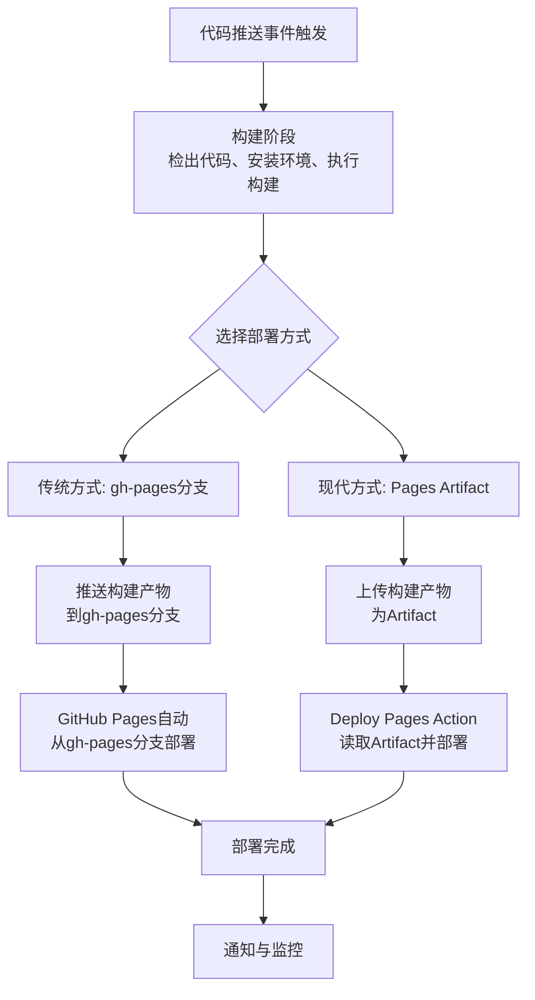

# Github两种部署模式

Github Actions的自动化部署流程主要支持如下两种部署方式：

```mermaid
flowchart TD
A[代码推送事件触发] --> B[构建阶段<br>检出代码、安装环境、执行构建]
B --> C{选择部署方式}
    
C --> D[传统方式: gh-pages分支]
D --> D1[推送构建产物<br>到gh-pages分支]
D1 --> D2[GitHub Pages自动<br>从gh-pages分支部署]
D2 --> F[部署完成]
    
C --> E[现代方式: Pages Artifact]
E --> E1[上传构建产物<br>为Artifact]
E1 --> E2[Deploy Pages Action<br>读取Artifact并部署]
E2 --> F
    
F --> G[通知与监控]
```

