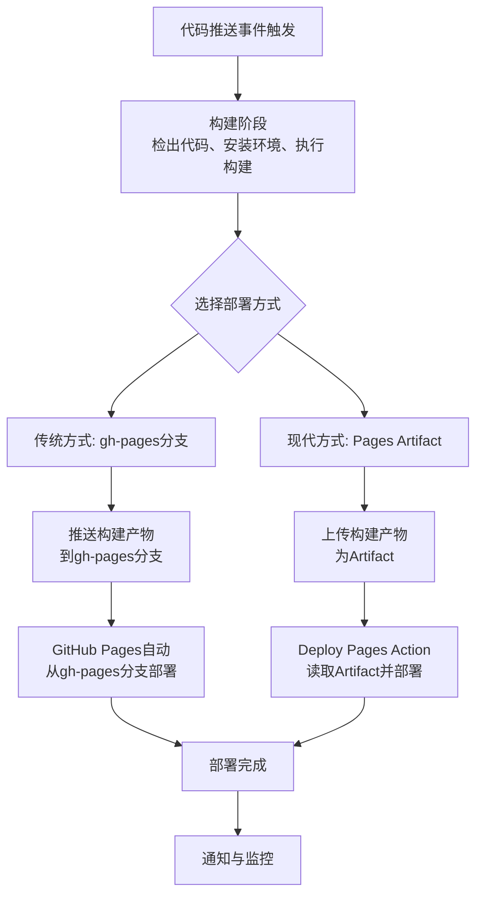

# Github Actions工作流

GitHub Actions 工作流是一项强大的自动化工具，它允许你在 GitHub 仓库中自动执行软件开发生命周期中的各种任务，如构建、测试、打包、发布和部署。

## 基础介绍

### 核心概念

GitHub Actions 的核心在于**工作流（Workflow）**，它是一个可配置的自动化过程，由一个或多个**作业（Jobs）** 组成，每个作业又包含一系列**步骤（Steps）**，这些步骤可以在特定**事件（Event）** 触发时在**运行器（Runner）** 上执行。

核心组件及其功能如下：

| 组件 (Component)      | 说明 (Description)                                           | 示例 (Example)                                    |
| :-------------------- | :----------------------------------------------------------- | :------------------------------------------------ |
| **工作流 (Workflow)** | 可配置的自动化过程，定义在 `.github/workflows`目录下的 YAML 文件中。 | `name: CI Pipeline`                               |
| **事件 (Event)**      | 触发工作流运行的特定活动，如推送代码、创建 PR 等。           | `on: [push, pull_request]`                        |
| **作业 (Job)**        | 一组在同一运行器上执行的步骤序列。一个工作流可以包含多个作业，默认并行执行，也可配置依赖关系串行执行。 | `jobs: build: runs-on: ubuntu-latest`             |
| **步骤 (Step)**       | 作业内的单个任务，可以运行命令或使用**操作（Action）**。     | `- name: Checkout code uses: actions/checkout@v3` |
| **操作 (Action)**     | 可重用的代码单元，是工作流的最小构建块，可用于简化复杂流程。 | `actions/checkout@v3`(检出代码)                   |
| **运行器 (Runner)**   | 执行工作流的服务器。可以是 GitHub 提供的**托管运行器**（如 Ubuntu, Windows, macOS），也可以是用户自己配置的**自托管运行器**。 | `runs-on: ubuntu-latest`                          |


### 工作流文件结构

工作流文件采用 YAML 格式，通常包含以下部分：

- **`name`**: 工作流的名称。
- **`on`**: 指定触发事件，例如 `push`, `pull_request`, `schedule`(定时任务)，或 `workflow_dispatch`(手动触发)。
- **`jobs`**: 定义工作流中要执行的一个或多个作业。
  - **`runs-on`**: 指定作业运行的虚拟机环境。
  - **`steps`**: 定义作业中要执行的步骤序列。
    - **`uses`**: 使用一个现有的 Action。
    - **`run`**: 执行一个 shell 命令或脚本。
    - **`name`**: 步骤的名称，便于在日志中识别。
    - **`with`**: 为 Action 提供输入参数。
    - **`env`**: 为步骤设置环境变量。

简单的工作流示例：

```yaml
name: CI/CD Pipeline
on:
  push:
    branches: [ main ]
  pull_request:
    branches: [ main ]
jobs:
  build:
    runs-on: ubuntu-latest
    steps:
      - uses: actions/checkout@v3
      - name: Set up environment
        run: echo "Setting up environment"
      - name: Build
        run: echo "Building application"
      - name: Test
        run: echo "Running tests"
      - name: Deploy
        if: github.ref == 'refs/heads/main'
        run: echo "Deploying to production"
```


### 主要应用场景

GitHub Actions 的应用场景非常广泛，主要包括：

- **持续集成 (CI)**：在代码提交后自动运行编译和测试，确保代码质量。例如，可以配置在每次推送代码或创建拉取请求时自动运行单元测试、集成测试。
- **持续部署 (CD)**：在代码通过测试后，自动部署到生产环境，如服务器、云平台（AWS、Azure）或容器平台（Kubernetes）。部署时可以结合策略如**蓝绿部署**或**金丝雀发布**以最小化风险。
- **自动化测试**：执行单元测试、集成测试、端到端测试等，并生成测试报告。
- **发布管理**：自动生成版本号、打包并发布到包管理器（如 npm、PyPI）。
- **自动化文档生成**：从代码注释自动生成 API 文档并部署到 GitHub Pages 等平台。
- **定期任务**：通过 `schedule`触发器执行定期任务，如清理缓存、安全检查等。


## 最佳实践

### 矩阵构建

**矩阵构建（matrix strategy）** 允许你**使用单个作业配置，自动在多个环境、版本或平台组合下并行运行任务**。

示例如下：下面配置会生成 2 * 3 个独立的作业，每个作业支持使用 `matrix.<variable-name>` 获取其上下文

```yaml
jobs:
  build:
    strategy:
      matrix:
        node-version: [14.x, 16.x, 18.x]
        os: [ubuntu-latest, windows-latest]
    runs-on: ${{ matrix.os }}
    steps:
      - uses: actions/checkout@v3
      - name: Use Node.js ${{ matrix.node-version }}
        uses: actions/setup-node@v3
        with:
          node-version: ${{ matrix.node-version }}
```


#### include和exclude

为了更精细地控制矩阵组合，你可以使用 `include`和 `exclude`关键字。

- **`include`**：用于向矩阵中添加**额外的、非自动生成的组合**，或为现有组合添加新的属性。
- **`exclude`**：用于**移除**自动生成的特定组合。

示例：

```yaml
strategy:
  matrix:
    os: [ubuntu-latest, windows-latest, macOS]
    node-version: [14.x, 16.x]
    include:
      # 添加一个未在原始矩阵中定义的 python-version 组合
      - os: ubuntu-latest
        node-version: 18.x # 与现有组合重复，但可以添加新属性
        python-version: '3.11' # 新属性
      - os: windows-latest
        node-version: 20.x # 全新的组合
      
      # 移除所有在 Windows 上运行 Node.js 14.x 的组合
      - os: windows-latest
        node-version: 14.x
      # 移除所有在 macOS 上运行 Node.js 16.x 的组合
      - os: macos-latest
        node-version: 16.x
```


#### 控制并行与失败策略

`fail-fast`（默认为 `true`）：如果任一矩阵作业失败，则取消所有正在进行的作业。将其设置为 `false`可以让所有作业完成，从而获得完整的兼容性报告。

`max-parallel`：限制同时运行的矩阵作业数量，可用于控制资源消耗。

```yaml
strategy:
  fail-fast: false # 一个失败不会影响其他作业
  max-parallel: 4   # 最多同时运行4个作业
  matrix:
    # ... 矩阵定义 ...
```


#### 缓存优化

矩阵作业通常需要安装依赖。为不同组合创建高效的缓存至关重要。

```yaml
- name: Cache dependencies
  uses: actions/cache@v3
  with:
    path: |
      ~/.npm
      node_modules
    # 缓存键应包含矩阵变量，以便为不同组合创建独立缓存
    key: ${{ runner.os }}-node-${{ matrix.node-version }}-${{ hashFiles('**/package-lock.json') }}
```


#### 结果聚合

- **调试**：使用 `act`工具在本地运行和调试矩阵工作流，无需反复提交代码。
- **结果聚合**：使用 `actions/upload-artifact`和 `actions/download-artifact`收集所有矩阵作业的测试结果（如覆盖率报告），并在最后一份作业中生成聚合报告。


#### 完整示例

```yaml
name: Python Matrix Test

on: [push, pull_request]

jobs:
  test:
    runs-on: ${{ matrix.os }}
    strategy:
      fail-fast: false
      matrix:
        # 定义主维度
        python-version: ['3.8', '3.9', '3.10', '3.11']
        os: [ubuntu-latest, windows-latest]
        # 定义依赖安装策略维度
        dependencies: [minimal, latest]
        
        # 使用 include 为特定组合添加额外变量或覆盖原有变量
        include:
          - python-version: '3.8'
            os: ubuntu-latest
            torch-version: '1.13.1' # 为 PyTorch 等特定库固定旧版本
          - python-version: '3.11'
            os: ubuntu-latest
            generate-coverage: true # 标记此组合用于生成最终覆盖率报告
            
        # 使用 exclude 排除不兼容或不需要的组合
        exclude:
          - python-version: '3.8'
            dependencies: 'latest' # Python 3.8 不测试最新依赖
          - os: windows-latest
            dependencies: 'latest' # Windows 上也不测试最新依赖

    steps:
    - name: Checkout code
      uses: actions/checkout@v4

    - name: Set up Python ${{ matrix.python-version }}
      uses: actions/setup-python@v5
      with:
        python-version: ${{ matrix.python-version }}
        cache: 'pip'
        cache-dependency-path: requirements.txt

    - name: Install dependencies (minimal)
      if: matrix.dependencies == 'minimal'
      run: pip install -r requirements.txt

    - name: Install dependencies (latest)
      if: matrix.dependencies == 'latest'
      run: |
        pip install -r requirements.txt
        pip install --upgrade pip
        pip-review --auto # 自动升级所有包到最新版本

    - name: Run tests with pytest
      run: pytest --cov=./ --cov-report=xml:coverage.xml -v
      env:
        PYTHONPATH: ${{ github.workspace }}

    - name: Upload coverage report
      if: always() # 即使测试失败也上传报告
      uses: actions/upload-artifact@v3
      with:
        name: coverage-py-${{ matrix.python-version }}-${{ matrix.os }}
        path: coverage.xml

  # 一个汇总报告的作业，在所有矩阵作业完成后运行
  combine-reports:
    needs: test # 依赖 test 作业
    runs-on: ubuntu-latest
    if: always() # 即使有测试失败也运行
    steps:
      - name: Download all coverage artifacts
        uses: actions/download-artifact@v3
        with:
          path: all-coverage-reports
          pattern: coverage-*
          merge-multiple: true

      - name: Combine coverage reports
        run: |
          pip install coverage
          python -m coverage combine all-coverage-reports/coverage-*.xml
          python -m coverage report --show-missing
          python -m coverage html
        shell: bash

      - name: Upload combined HTML report
        uses: actions/upload-artifact@v3
        with:
          name: combined-coverage-report
          path: htmlcov
```


### 缓存依赖

#### 核心参数说明

GitHub Actions 的 `actions/cache@v4`是一个非常重要的工具，它能通过**缓存依赖和构建产物来显著提升 CI/CD 流程的效率**，避免重复下载和编译，从而节省时间和计算资源。


核心参数说明：

- **`path`**：指定需要缓存的目录或文件的路径。可以是一个路径，也可以是多行字符串指定多个路径。
- **`key`**：缓存唯一的标识符。通常根据 runner 的操作系统、项目依赖文件（如 `package-lock.json`）的哈希值等来生成。**只有当 `key`完全匹配时，才会恢复缓存**。
- **`restore-keys`**：当没有找到与 `key`完全匹配的缓存时，会尝试用 `restore-keys`列表（按顺序）进行**前缀匹配**。这有助于找到相似的缓存，实现渐进式恢复。


缓存键（Key）策略：设计一个好的 `key`是高效利用缓存的关键。

| 策略                 | 描述                                                      | 示例                                                         |
| :------------------- | :-------------------------------------------------------- | :----------------------------------------------------------- |
| **基于依赖文件哈希** | 最常用。依赖文件（如lock文件）内容变化时，缓存自动失效。  | `key: ${{ runner.os }}-node-${{ hashFiles('**/package-lock.json') }}` |
| **按操作系统分离**   | 不同操作系统的依赖和构建产物通常不兼容，需分开缓存。      | `key: ${{ runner.os }}-pip-${{ hashFiles('**/requirements.txt') }}` |
| **复合键**           | 结合多个维度（如OS、语言版本、项目）生成更精确的键。      | `key: ${{ runner.os }}-py-${{ matrix.python-version }}-${{ hashFiles('**/requirements.txt') }}` |
| **短期缓存**         | 用于临时性需求，如调试。通常与工作流运行ID或提交SHA绑定。 | `key: cache-${{ github.run_id }}`                            |


#### 不同语言的缓存设计

**正确设置缓存路径（Path）**：路径设置是缓存恢复的关键。你需要根据操作系统和语言环境，准确指定需要缓存的目录。常见路径包括：

| 环境/工具       | 缓存路径（Linux示例）                         | 缓存内容                         |
| :-------------- | :-------------------------------------------- | :------------------------------- |
| **Node.js/npm** | `~/.npm`                                      | npm 缓存目录                     |
| **Python/pip**  | `~/.cache/pip`                                | pip 缓存目录                     |
| **Rust/Cargo**  | `~/.cargo/registry`, `~/.cargo/git`, `target` | Cargo 注册表、git 依赖和构建输出 |
| **Java/Gradle** | `~/.gradle/caches`, `~/.gradle/wrapper`       | Gradle 缓存和包装器              |
| **通用容器**    | `node_modules`, `venv`, `target/release`      | 项目级的依赖目录和输出           |

示例如下：

1、JavaScript (npm)：缓存 npm 的缓存目录，而不是直接缓存 `node_modules`。

```yaml
- name: Get npm cache directory
  id: npm-cache-dir
  shell: bash
  run: echo "dir=$(npm config get cache)" >> ${GITHUB_OUTPUT}
- name: Cache npm dependencies
  uses: actions/cache@v4
  with:
    path: ${{ steps.npm-cache-dir.outputs.dir }}
    key: ${{ runner.os }}-node-${{ hashFiles('**/package-lock.json') }}
```

2、Python (pip)：Python 的缓存路径因操作系统而异，在矩阵构建中需特别注意。

```yaml
jobs:
  build:
    strategy:
      matrix:
        os: [ubuntu-latest, macos-latest, windows-latest]
        include:
          - os: ubuntu-latest
            path: ~/.cache/pip
          - os: macos-latest
            path: ~/Library/Caches/pip
          - os: windows-latest
            path: ~\AppData\Local\pip\Cache
    steps:
      - uses: actions/cache@v4
        with:
          path: ${{ matrix.path }}
          key: ${{ runner.os }}-pip-${{ hashFiles('**/requirements.txt') }}
```

3、Java (Maven)：Maven 的依赖默认存储在 `.m2`目录下。

```yaml
- uses: actions/cache@v4
  with:
    path: ~/.m2/repository
    key: ${{ runner.os }}-maven-${{ hashFiles('**/pom.xml') }}
```

4、Java (Gradle)：Gradle 缓存包括依赖和包装器。

> 注意：缓存 Gradle 时需确保 Gradle 守护进程已停止，避免文件锁定。

```yaml
- uses: actions/cache@v4
  with:
    path: |
      ~/.gradle/caches
      ~/.gradle/wrapper
    key: ${{ runner.os }}-gradle-${{ hashFiles('**/*.gradle*') }}
```

5、Go：Go 的缓存路径也因操作系统不同而变化。

```yaml
- uses: actions/cache@v4
  with:
    path: |
      ~/.cache/go-build   # Linux
      ~/go/pkg/mod        # Go module cache
    key: ${{ runner.os }}-go-${{ hashFiles('**/go.sum') }}
```


#### 缓存命中检查

可以通过 `outputs`判断缓存是否命中，从而决定是否跳过安装步骤。

```yaml
- name: Check cache
  id: cache-check
  uses: actions/cache@v4
  with:
    path: ${{ matrix.path }}
    key: ...
- name: Install dependencies
  if: steps.cache-check.outputs.cache-hit != 'true'
  run: pip install -r requirements.txt
```


#### 缓存键重用

**保存缓存时重用键**：在 `save`阶段重用 `restore`阶段计算出的键，避免重复计算。

```yaml
- uses: actions/cache/restore@v4
  id: restore-cache
  with:
    path: path/to/dependencies
    key: ${{ runner.os }}-key-${{ hashFiles('**/lockfile') }}
- # ... build steps that may change the dependencies ...
- uses: actions/cache/save@v4
  with:
    path: path/to/dependencies
    key: ${{ steps.restore-cache.outputs.cache-primary-key }}
```


#### 分支缓存隔离与共享

**分支缓存隔离与共享**：为不同分支创建独立的缓存，但允许回退到主分支缓存。

```yaml
- uses: actions/cache@v4
  with:
    path: path/to/dependencies
    key: ${{ runner.os }}-npm-${{ github.ref_name }}-${{ hashFiles('**/package-lock.json') }}
    restore-keys: |
      ${{ runner.os }}-npm-main-  # 回退到主分支缓存
      ${{ runner.os }}-npm-       # 最后回退到任何npm缓存
```


#### 缓存最佳实践

- **缓存内容**：优先缓存**依赖管理工具的缓存目录**（如 `~/.npm`、`~/.cache/pip`），而非直接缓存 `node_modules`或 `target`等构建输出目录。后者可能更大且效果不佳。
- **缓存限制**：GitHub 对缓存有**容量和时间限制**。每个仓库的缓存总大小限制为 **10GB**，如果超过此限制，最早创建的缓存将被删除。
- **避免缓存污染**：确保 `key`中包含足够唯一的标识（如依赖文件哈希），防止依赖变更后仍使用旧的缓存。
- **清理缓存**：定期清理无用缓存。可以使用 GitHub API 或在工作流中添加清理步骤。

```yaml
- name: Clean old cache files
  run: |
    find ~/.gradle/caches -type f -mtime +30 -delete
```


### 变量管理

#### secrets

**安全管理敏感信息**：**切勿**将密码、API 密钥等敏感信息直接写入工作流文件。应使用 GitHub 仓库设置中的 **Secrets** 功能安全地存储和引用它们。

Github Secrets允许你在仓库或组织级别加密存储敏感数据，这些数据在工作流运行时会通过环境变量注入，并且 GitHub 会自动屏蔽日志中的这些值以防泄露。支持创建如下三种Secret：

| 类型              | 创建位置                                        | 访问范围                               | 适用场景                                                     |
| :---------------- | :---------------------------------------------- | :------------------------------------- | :----------------------------------------------------------- |
| **仓库级 Secret** | 仓库 Settings → Secrets and variables → Actions | 仅限该仓库                             | 单个仓库专用的密钥，如部署到特定服务器的 SSH 私钥            |
| **组织级 Secret** | 组织 Settings → Secrets and variables → Actions | 组织内所有仓库或指定仓库               | 在多个仓库间共享的密钥，如统一的 Docker Hub 账号             |
| **环境级 Secret** | 仓库 Settings → Environments → 具体环境         | 需在作业中指定 `environment`时才可访问 | 为不同环境（如测试、生产）提供差异化配置，如生产环境的数据库密码 |


在工作流中使用Secrets：通过 ${{secrets.SECRET_NAME}}来引用配置的Secret

```yaml
jobs:
  build:
    runs-on: ubuntu-latest
    env: 
      # 在作业级别定义环境变量，所有步骤均可使用，不推荐
      DEPLOY_TOKEN: ${{ secrets.API_KEY }}
    steps:
      - name: Checkout code
        uses: actions/checkout@v4

      - name: 使用环境变量示例
        run: echo "使用密钥进行操作" # 在脚本中通过 $DEPLOY_TOKEN 访问
       
      - name: 安全使用 Secret 示例
        env: 
          # 在步骤级别设置环境变量，推荐方式
          MY_SECRET: ${{ secrets.API_KEY }}
          DB_PASSWORD: ${{ secrets.DB_PASSWORD }}
        run: |
          # 在脚本中使用环境变量，而不是直接引用 secrets
          curl -H "Authorization: Bearer $MY_SECRET" https://api.example.com/data
          ./my_script --db-pass="$DB_PASSWORD" # 通过参数传递也更安全

      - name: 直接引用 Secret
        run: echo "密钥是 ${{ secrets.API_KEY }}" # ❌ 不推荐，值虽会被屏蔽，但可能有日志泄露风险

      - name: 使用 SSH 连接到服务器
        uses: appleboy/ssh-action@v1
        with:
          host: ${{ secrets.SERVER_HOST }}
          username: ${{ secrets.SSH_USERNAME }}
          key: ${{ secrets.SSH_PRIVATE_KEY }} # 传递 SSH 私钥
          script: sudo deploy.sh
```


基于环境的条件访问：通过指定environment来使用该环境下配置的特定secrets

```yaml
jobs:
  deploy-prod:
    runs-on: ubuntu-latest
    environment: production # 指定环境，从而使用该环境下的 Secrets
    steps:
      - name: 部署到生产环境
        env:
          PROD_API_KEY: ${{ secrets.PROD_API_KEY }} # 使用 production 环境下的 Secret
        run: ./deploy.sh --env=production
```


在矩阵构建中动态选择secrets：利用矩阵策略和 `format`函数动态生成要引用的 Secret 名称

```yaml
jobs:
  deploy:
    runs-on: ubuntu-latest
    strategy:
      matrix:
        env: [staging, production] # 定义矩阵变量
    steps:
      - name: 动态选择 Secret
        env:
          # 根据矩阵变量动态生成 Secret 名称，例如 secrets.STAGING_API_KEY 或 secrets.PROD_API_KEY
          API_KEY: ${{ secrets[format('{0}_API_KEY', matrix.env)] }}
        run: ./deploy.sh --env=${{ matrix.env }}
```


secrets 安全管理最佳实践：

1. **遵循最小权限原则**：只为 Secret 分配完成任务所需的最小权限

2. **严防日志泄露**

   + **避免在命令中直接输出**：如 `echo "${{ secrets.KEY }}"`。虽然 GitHub 会尝试屏蔽，但仍有风险。

   + **避免通过命令行参数传递**：命令行参数可能会被进程列表捕获。优先使用环境变量或配置文件。

     ```yaml
     # 不推荐
     - run: ./script.sh --password=${{ secrets.DB_PASSWORD }} # ❌
     
     # 推荐
     - env:
         DB_PASS: ${{ secrets.DB_PASSWORD }}
       run: ./script.sh # ✅ 脚本内部从 $DB_PASS 环境变量读取
     ```

3. **谨慎审核第三方 Actions**：在将 Secrets 传递给第三方 Actions（如 `with:`或 `env:`）时，务必审查其代码是否可信，防止恶意代码窃取密钥。

4. **处理 Pull Request 的安全**：来自外部分支的 Pull Request 默认无法访问仓库 Secrets。**切勿**在由 `pull_request`事件触发的工作流中执行敏感操作或访问 Secrets。应使用 `push`事件（例如在合并到主分支后）来触发部署流程。

5. **定期轮换密钥**：制定计划定期更新 Secrets（例如每 90 天）。你可以使用 GitHub API 和 Personal Access Token 自动化这一过程。

6. **审计与监控**：定期检查 GitHub 组织的审计日志，监控 Secrets 的创建、修改和访问情况。

7. **公共仓库禁用敏感 Secrets**：**绝对不要**在公共仓库中使用真正敏感的 Secrets，因为恶意用户可能通过构造特殊的工作流来窃取它们。


常见问题：

1. **Secret 未生效**：首先检查 Secret 名称的**拼写和大小写**是否与引用处完全一致。确认 Secret 已正确添加到预期的范围（仓库、组织或环境）。

2. **在 PR 中无法访问 Secret**：这是出于安全考虑的设计。如果确实需要，可考虑使用 `pull_request_target`事件，但务必了解其安全风险并添加额外防护条件（例如仅允许来自本仓库的 PR）。

3. **本地开发如何模拟**：在项目根目录创建 `.env`文件，并使用 `git update-index --assume-unchanged .env`或将其添加到 `.gitignore`中来避免提交。在工作流中，可以通过步骤生成这些环境变量。

   ```bash
   # .env 文件示例
   API_KEY=your_local_api_key_here
   DB_PASSWORD=your_local_db_password_here
   ```


#### vars

GitHub Actions 中的 `vars`上下文用于访问在**仓库级别、组织级别或环境级别**定义的**配置变量**。这些变量通常用于存储**非敏感**的配置信息，例如资源路径、功能标志或服务器名称。

| 方面                 | 说明                                                         | 示例或用法                                                   |
| :------------------- | :----------------------------------------------------------- | :----------------------------------------------------------- |
| **定义位置与优先级** | 变量可在**环境**、**仓库**、**组织**级别定义。**环境级**变量优先级最高，其次为**仓库级**，最后是**组织级**。 | 定义路径：仓库 Settings → Secrets and variables → Actions → Variables tab。 |
| **访问方式**         | 在工作流文件中使用 `${{ vars.VARIABLE_NAME }}`语法引用。     | `${{ vars.API_BASE_URL }}`                                   |
| **与 Secrets 区别**  | `vars`用于**非敏感**配置信息，值会以明文形式存储在日志中。**敏感信息**务必使用 `secrets`。 | 数据库密码应使用 `secrets`，部署环境标识可使用 `vars`。      |
| **常用场景**         | 配置不同环境（如开发、生产）的参数，设置构建标志，共享公共资源路径等。 | `environment: ${{ vars.ENVIRONMENT }}`                       |


定义配置变量：

1. **仓库级别**：在仓库的 **Settings > Secrets and variables > Actions > Variables** 标签页下，点击 **New repository variable** 来添加。此变量仅对该仓库可见。
2. **组织级别**：在组织的 **Settings > Secrets and variables > Actions > Variables** 标签页下，点击 **New organization variable** 来添加。你可以选择让变量对所有仓库可见，或仅限选择的仓库。
3. **环境级别**：在仓库的 **Settings > Environments** 下，选择或创建一个环境，然后在其 **Environment variables** 部分添加。此变量仅对引用该环境的工作流作业可见。


变量名称限制：

- 名称只能包含字母数字字符（`[a-z]`, `[A-Z]`, `[0-9]`）或下划线（`_`）。
- 不能以 `GITHUB_`前缀开头。
- 不能以数字开头。
- 不区分大小写。
- 在创建它的仓库、组织或环境中必须唯一。


配置变量数量和大小限制：

- 单个变量大小限制为 **48 KB**。
- 一个组织最多可存储 **1,000** 个变量，一个仓库最多 **500** 个变量，一个环境最多 **100** 个变量。
- 组织和仓库变量的总大小限制为每个工作流运行 **10 MB**（环境级别变量不计入此限制）。


工作流中变量使用示例：

```yaml
name: Deployment
on:
  workflow_dispatch: # 手动触发工作流
env:
  # 可以从 vars 中取值来设置环境变量
  DEPLOYMENT_ENV: ${{ vars.ENVIRONMENT }}
jobs:
  deploy:
    runs-on: ubuntu-latest
    environment: ${{ vars.ENVIRONMENT }} # 使用变量指定环境
    steps:
      - name: Checkout code
        uses: actions/checkout@v4

      - name: Debug variables
        run: |
          echo "Deploying to: $DEPLOYMENT_ENV"
          echo "API URL: ${{ vars.API_BASE_URL }}"
          echo "Max retries: ${{ vars.MAX_RETRIES }}"

      - name: Deploy to server
        if: ${{ vars.SHOULD_DEPLOY == 'true' }} # 使用变量控制步骤执行
        run: ./deploy.sh --env $DEPLOYMENT_ENV
```


注意事项：

1. **变量优先级**：如果同名变量在多个级别定义，**环境级**变量优先级最高，其次是**仓库级**，最后是**组织级**。
2. **可重用工作流**：在可重用工作流中，使用的是**调用方**工作流仓库的变量。被调用工作流仓库中定义的变量对调用方不可用。
3. **默认环境变量**：GitHub 还提供了一系列默认环境变量（如 `GITHUB_REPOSITORY`），它们与 `vars`上下文不同，通常以 `GITHUB_`或 `RUNNER_`开头，并且是只读的。


#### secrets、vars、env对比

| 特性         | `vars`(配置变量)       | `env`(环境变量)                     | `secrets`(机密)              |
| :----------- | :--------------------- | :---------------------------------- | :--------------------------- |
| **用途**     | 非敏感配置             | 主要在工作流内部定义非敏感数据      | **敏感信息**（如密钥、令牌） |
| **定义位置** | 仓库、组织、环境设置   | 工作流文件内部 (`env`关键字)        | 仓库、组织、环境设置         |
| **访问方式** | `${{ vars.VAR_NAME }}` | `${{ env.VAR_NAME }}`或 `$VAR_NAME` | `${{ secrets.SECRET_NAME }}` |
| **日志显示** | **明文显示**           | 明文显示（除非手动屏蔽）            | **自动屏蔽**                 |
| **适用范围** | 可跨仓库（组织变量）   | 仅限于定义它的工作流、作业或步骤    | 可跨仓库（组织机密）         |

最佳实践：

- **绝不**将密码、API 密钥等敏感信息存入 `vars`，务必使用 `secrets`。
- 对于需要在不同工作流或仓库间共享的**非敏感**配置，`vars`（特别是组织变量）非常有用。
- 对于工作流**内部**使用的临时变量或脚本使用的变量，使用 `env`更合适。


### 优化工作流结构

- 使用 `needs`关键字来定义作业之间的依赖关系，确保它们按顺序执行。
- 使用 `if`条件语句来控制步骤或作业仅在特定条件下运行。
- 将复杂的工作流分解为多个更小、更专注的工作流文件。
- 为长时间运行的作业设置 `timeout-minutes`，避免资源浪费。


### 查看日志和调试

作流运行后，可以在 GitHub 仓库的 "Actions" 标签页下查看详细日志，这有助于排查失败原因。可以使用 `actions/upload-artifact`Action 上传构建产物或日志文件以便进一步分析。


## 部署模式

Github Actions的自动化部署流程主要支持如下两种部署方式：



### 部署到gh-pages分支

部署到gh-pages是早期的主流做法，通过将构建的好的静态文件推送到仓库内一个单独的gh-pages分支来实现部署。

示例：

```yaml
name: Deploy to GitHub Pages (Old)
on:
  push:
    branches: [ main ]
jobs:
  deploy:
    runs-on: ubuntu-latest
    steps:
      - name: Checkout code
        uses: actions/checkout@v4 # 检出代码
      - name: Install and Build
        run: |
          npm install
          npm run build # 执行项目构建
      - name: Deploy to gh-pages branch
        uses: peaceiris/actions-gh-pages@v3 # 使用第三方Action
        with:
          github_token: ${{ secrets.GITHUB_TOKEN }} # 使用GITHUB_TOKEN认证
          publish_dir: ./dist # 指定构建输出目录
```


### Pages Artifact

Pages Artifact：将构建产物打包为一个 `artifact`上传，最后由专门的 Action 将其部署到 GitHub Pages。

示例：

```yaml
name: Deploy to GitHub Pages (Modern)
on:
  push:
    branches: [ main ]
permissions: # ⚠️ 必须配置权限
  contents: read
  pages: write
  id-token: write
jobs:
  build:
    runs-on: ubuntu-latest
    steps:
      - name: Checkout code
        uses: actions/checkout@v4
      - name: Setup Node.js
        uses: actions/setup-node@v4
        with:
          node-version: '20'
          cache: 'npm' # 缓存依赖以加速构建
      - name: Install dependencies
        run: npm ci # 更严格、更快的依赖安装
      - name: Build
        run: npm run build
      - name: Upload artifact
        uses: actions/upload-pages-artifact@v3 # ⚡ 上传产物
        with:
          path: './dist' # 指定构建输出目录
  deploy:
    needs: build # 依赖build任务
    runs-on: ubuntu-latest
    environment:
      name: github-pages
      url: ${{ steps.deployment.outputs.page_url }} # 获取部署后的URL
    steps:
      - name: Deploy to GitHub Pages
        uses: actions/deploy-pages@v4 # ⚡ 官方部署Action
```


配置注意事项：

- **权限配置 (必须)**：必须在工作流文件中显式声明 `permissions`，或是在仓库的 `Settings > Actions > General`中授予工作流**读写权限**。
- **环境设置**：部署任务中的 `environment`配置是可选的，但设置后可以在仓库的 `Environments`中查看每次部署的详细记录。


## 自定义域名和HTTPS

为 GitHub Pages 设置自定义域名和 HTTPS 可以让你的网站看起来更专业、更安全。整个过程主要分为**配置域名解析**、**在 GitHub 中设置**以及**验证 HTTPS** 几个关键步骤。


### 前期准备

1. **拥有一个 GitHub Pages 站点**：你的 `<username>.github.io`仓库或配置为 GitHub Pages 的项目仓库应已构建并可通过默认地址访问。
2. **拥有一个自定义域名**：你需要在域名注册商（如阿里云、腾讯云、GoDaddy、Namecheap 等）购买一个域名。


### 配置自定义域名

#### 配置DNS解析记录

登录你的域名注册商管理后台，找到 DNS 解析设置。根据你的需求选择以下一种或两种方式配置。

1、为根域名（如 example.com）配置：你需要添加 **4 条 A 记录**，将域名指向 GitHub Pages 的 IP 地址。这是为了冗余和负载均衡，提升可用性。

| 主机记录 (Name) | 记录类型 (Type) | 记录值 (Value / IP) |
| :-------------- | :-------------- | :------------------ |
| `@`             | A               | 185.199.108.153     |
| `@`             | A               | 185.199.109.153     |
| `@`             | A               | 185.199.110.153     |
| `@`             | A               | 185.199.111.153     |

2、为子域名（如 www.example.com）配置：

添加 **1 条 CNAME 记录**，将子域名指向你的 GitHub Pages 默认域名。

| 主机记录 (Name) | 记录类型 (Type) | 记录值 (Value)         |
| :-------------- | :-------------- | :--------------------- |
| `www`           | CNAME           | `<username>.github.io` |


#### 在Github仓库中设置

1. 进入你的 GitHub Pages 对应的仓库。
2. 点击 **Settings** 选项卡。
3. 在左侧边栏中找到 **Pages**。
4. 在 **Custom domain** 字段中，输入你的自定义域名（例如 `www.example.com`或 `example.com`），然后点击 **Save**。
5. **建议**：为了确保自定义域名设置持久化，最好在仓库的根目录下创建一个名为 `CNAME`的文件（无后缀），内容就是你的自定义域名（如 `example.com`），然后提交该文件。


#### 启用HTTPS

GitHub Pages **默认会自动为你的站点提供 HTTPS 支持**。但在你配置自定义域名后，可能需要手动启用或等待其自动配置。

1. 在仓库的 **Settings > Pages** 页面，找到 **Enforce HTTPS** 选项。
2. 如果它尚未被勾选，并且不是灰色不可用状态，请勾选它。
3. 如果该选项暂时不可用，通常意味着 GitHub 正在为你的自定义域名申请和配置 SSL 证书，**这个过程可能需要几分钟到几小时**。请耐心等待，并时不时回来查看，一旦可用，立即勾选。

启用 HTTPS 后，访问你的网站将会通过安全的加密连接，并且浏览器地址栏会显示锁形图标。


注意事项：

1. **混合内容警告**：开启 HTTPS 后，如果你的网页通过 `http://`加载了图片、CSS 或 JavaScript 等资源，浏览器会报“混合内容”错误，部分资源可能被阻止加载。请确保网页中所有资源的链接都是相对路径或使用了 `https://`。
2. **“HTTPS 选项不可用或无法开启”**：检查你的 DNS 配置中是否包含了任何非 GitHub 的 IP 或地址，这可能会干扰证书签发。