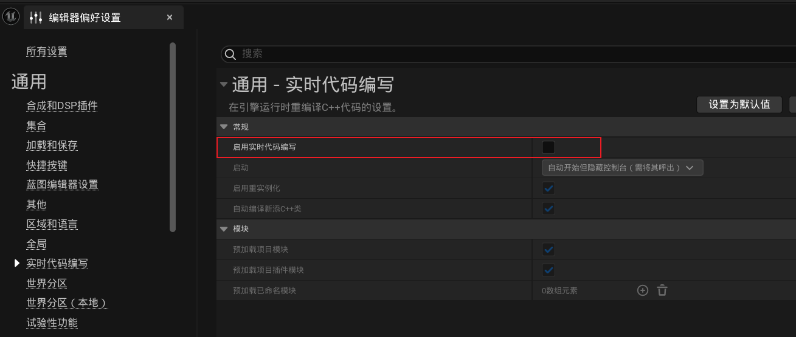

# 基础入门

#### UE5安装

1、进入ue5官网并下载启动器：[https://www.unrealengine.com/zh-CN/download](https://www.unrealengine.com/zh-CN/download)

 

2、安装下载好的启动程序，注册账号并登录，登录后按照下图所示进行安装引擎（安装过程需要勾选协议并支持自定义安装位置）：

 

#### 项目创建

推荐配置：

1、编辑 -> 编辑器偏好设置 -> 资产编辑器打开路径，切换为主窗口

 

2、编辑 -> 编辑器偏好设置 -> 实时代码编写 -> 启用实时代码编写取消勾选

 

3、编辑 -> 编辑器偏好设置 -> 源代码 -> 源代码编辑器选择Visual Studio 2022：

 

以及Visual Studio 2022的组件：

 

4、如果时通过`First Person`或`Third Person`、`Top Down`等有默认的代码模板生成的项目，最好将头文件中的属性指针修改为`TObjectPtr<T>`

