# Stable Diffusion WebUI forge部署Flux模型

### Stable Diffusion WebUI Forge下载

Stable Diffusion WebUI Forge Github网址：[https://github.com/lllyasviel/stable-diffusion-webui-forge](https://github.com/lllyasviel/stable-diffusion-webui-forge)

下载：[根据当前机器的CUDA版本](./03-cuda-install.md)，选择合适的安装包，此处选择推荐包

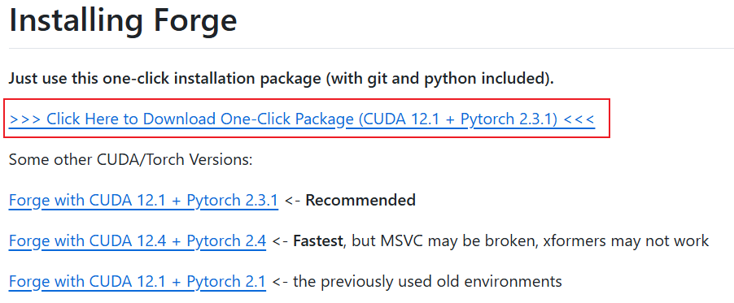 

下载完成后，先执行update.bat脚本，再执行run.bat脚本。


### Flux模型

参考：

+ [https://www.youtube.com/watch?v=pC2H_GGyuUU](https://www.youtube.com/watch?v=pC2H_GGyuUU)
+ [https://www.youtube.com/watch?v=WCs4ApMC7uU](https://www.youtube.com/watch?v=WCs4ApMC7uU)

Flux模型分类：

+ Flux.1 pro：性能最强大，非开源仅支持API调用
+ Flux.1 dev：性能较好，开源模型，非商业许可
+ Flux.1 schnell：开源，在Apache2.0许可下商用

ComfyUI相关文件存放位置：

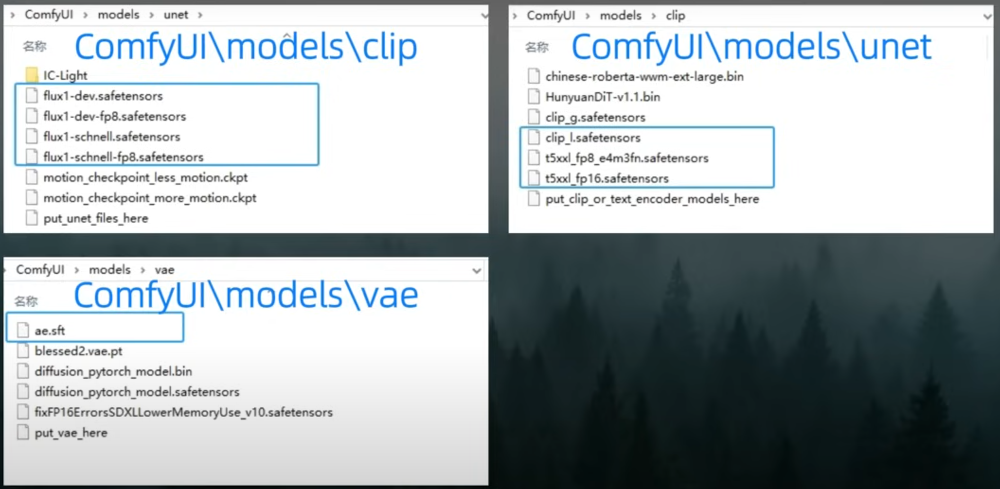 


#### 下载Flux官方FP16模型

Flux模型说明页面：[https://github.com/lllyasviel/stable-diffusion-webui-forge/discussions/1050](https://github.com/lllyasviel/stable-diffusion-webui-forge/discussions/1050)

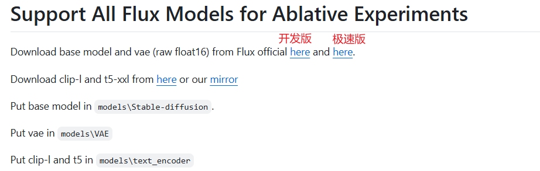 


1、下载基础模型和vae（负责从潜在空间解码生成像素空间的最终图像）：

+ 开发版：[https://huggingface.co/black-forest-labs/FLUX.1-dev/tree/main](https://huggingface.co/black-forest-labs/FLUX.1-dev/tree/main)
+ 极速版：[https://huggingface.co/black-forest-labs/FLUX.1-schnell](https://huggingface.co/black-forest-labs/FLUX.1-schnell)

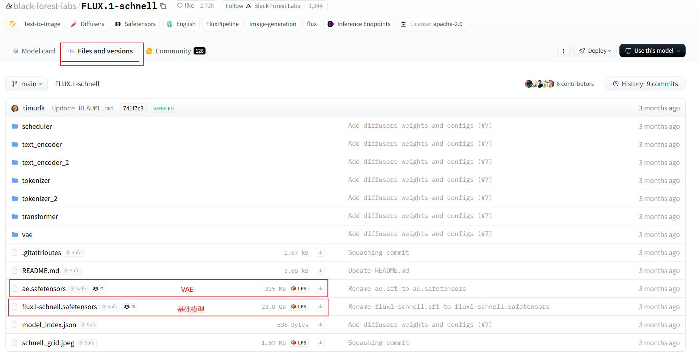 

下载上图圈出来的两个文件，并放置到安装目录：

+ flux1-schnell.safetensors 放到 models\Stable-diffusion 目录
+ ae.safetensors 放到 models\VAE 目录


2、下载clip-l和t5：负责将文本提示转换成模型能理解的格式

+ 原仓库地址：[https://huggingface.co/comfyanonymous/flux_text_encoders/tree/main](https://huggingface.co/comfyanonymous/flux_text_encoders/tree/main)
+ 镜像仓地址：[https://huggingface.co/lllyasviel/flux_text_encoders/tree/main](https://huggingface.co/lllyasviel/flux_text_encoders/tree/main)

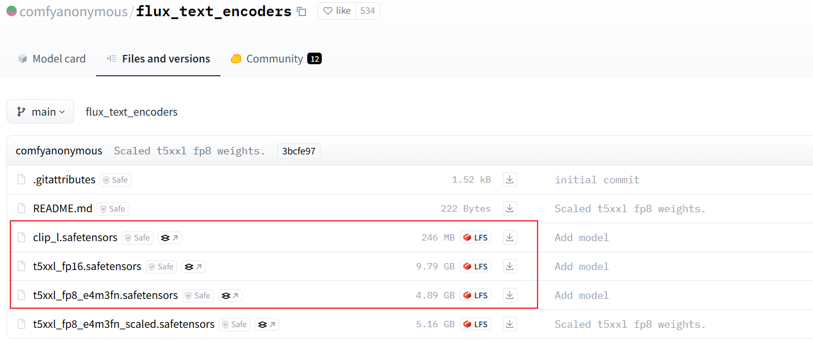 

下载圈起来的三个文件，并全部放到 models\text_encoder 目录


#### 下载精简FP8模型

##### Kijai版大模型

下载地址：[https://huggingface.co/Kijai/flux-fp8/tree/main](https://huggingface.co/Kijai/flux-fp8/tree/main)

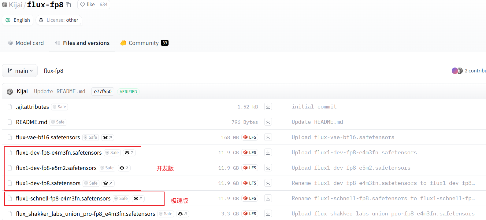 

下载后放到 models\Stable-diffusion 目录


##### Comfy UI版

下载地址：[https://huggingface.co/Comfy-Org/flux1-schnell/tree/main](https://huggingface.co/Comfy-Org/flux1-schnell/tree/main)

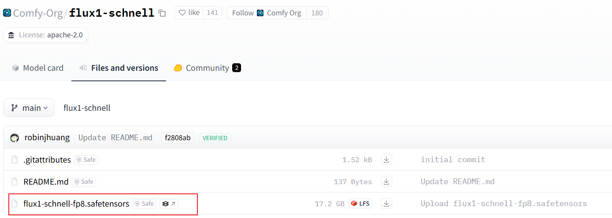 

下载后放到 models\Stable-diffusion 目录


#### 下载GGUF模型（适合显存较小的用户）

说明页：[https://github.com/lllyasviel/stable-diffusion-webui-forge/discussions/1050](https://github.com/lllyasviel/stable-diffusion-webui-forge/discussions/1050)

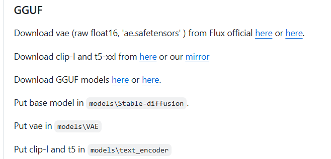 

下载GGUF模型：

+ 开发版：[https://huggingface.co/lllyasviel/FLUX.1-dev-gguf](https://huggingface.co/lllyasviel/FLUX.1-dev-gguf)
+ 极速版：[https://huggingface.co/lllyasviel/FLUX.1-schnell-gguf](https://huggingface.co/lllyasviel/FLUX.1-schnell-gguf)

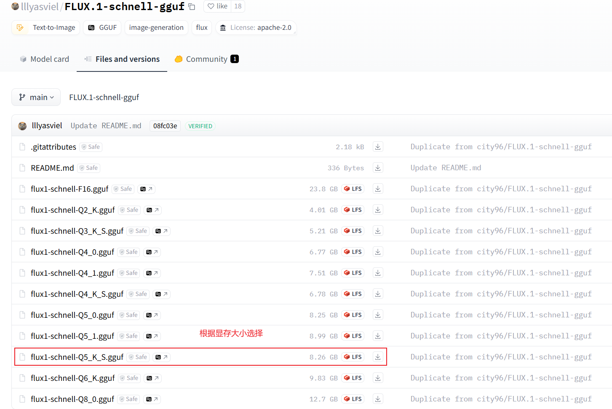  

下载文件放在 models\Stable-diffusion 目录


#### 下载NF4

说明页：[https://github.com/lllyasviel/stable-diffusion-webui-forge/discussions/981](https://github.com/lllyasviel/stable-diffusion-webui-forge/discussions/981)

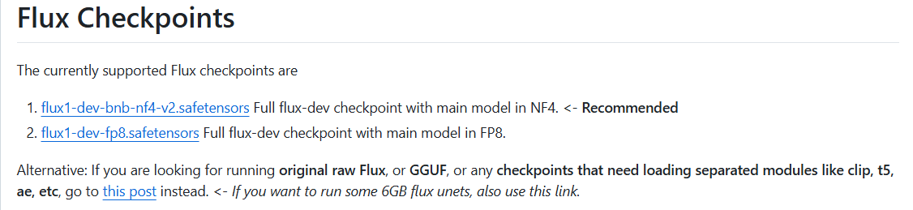 

+ 30、40系显卡：[https://huggingface.co/lllyasviel/flux1-dev-bnb-nf4/blob/main/flux1-dev-bnb-nf4-v2.safetensors](https://huggingface.co/lllyasviel/flux1-dev-bnb-nf4/blob/main/flux1-dev-bnb-nf4-v2.safetensors)
+ 其他显卡：[https://huggingface.co/lllyasviel/flux1_dev/blob/main/flux1-dev-fp8.safetensors](https://huggingface.co/lllyasviel/flux1_dev/blob/main/flux1-dev-fp8.safetensors)

下载完成后，放入 models\Stable-diffusion 目录


#### Flux模型使用说明

Flux1-SCHNELL、KIJAI、GGUF使用时需要配套开启clip和vae；而ComfyUI和NF4已经融合了clip和vae，可以直接出图。

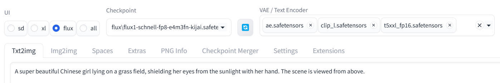 


Flux Guidance取值说明：

+ 当值在1附近时，图像可能会显得灰暗
+ 当值在2附近时，更适合生成艺术绘画风格的图像
+ 当值在3到3.5时，能应对不同场景
+ 当值超过3.5时，图像的细节可能会增强，但对比度可能也会很高

Flux推荐的采样器组合：

+ ipdmn + simple
+ uni_pc_bh2 + simple
+ euler + beta
+ euler + simple
+ dpmpp + sgm_uniform


#### Flux模型常用提示词

##### 常用提示词

特殊效果：[https://www.maxbon.cn/archives/QdkQ7m4z](https://www.maxbon.cn/archives/QdkQ7m4z)

```
# 角色表情包
# 形象：写想生成的形象，如狗
# 形象描述：写形象的基本特征，如红头发白皮肤
An anime [形象], [形象描述],animated expression reference sheet, character design, reference sheet, turnaround, lofi style, soft colors, gentle natural linework, key art, range of emotions, happy sad mad scared nervous embarrassed confused neutral, hand drawn, award winning anime, fully clothed

# 全角度角色视图
# 形象：写想生成的形象，如狗
A character sheet of [形象] in different poses and angles, including front view, side view, and back view

# 双重曝光效果
# 内景：想生成的内景，比如森林
# 外景：写外景，比如狗狗
[内景] Inside a [外景]'s head, it's a double exposure photo. Non-figurative, colors and shapes, emotional expression, imaginative, highly detailed

# 照镜子效果
Cell phone photo of a dog taking a selfie in front of a mirror. The photo quality is grainy and details are slightly blurred. The lighting is dim and shadows obscure her features. [The room is messy, clothes are scattered on the bed, and the blanket is not laid out properly. Her expression is casual and focused], and the old iPhone has a hard time focusing, making the photo look real and unpolished. The mirror is covered with smudges and fingerprints, adding a raw, everyday vibe to the scene
```


##### 图片风格

原网址：[https://www.onetts.com/prompt/flux-prompt/106/](https://www.onetts.com/prompt/flux-prompt/106/)

艺术风格：

- 印象派：impressionist, soft brushstrokes, light and color, natural scenes
- 立体主义：cubist, geometric shapes, multiple viewpoints, fragmented forms
- 超现实主义：surrealist, dreamlike, unexpected juxtapositions, bizarre imagery
- 波普艺术：pop art, bold colors, popular culture, graphic style
- 抽象表现主义：abstract expressionist, gestural brushstrokes, emotional intensity, large scale
- 点彩派：pointillism, dots, vibrant colors, optical mixing
- 新古典主义：neoclassical, idealized forms, symmetry, historical themes
- 未来主义：futurist, dynamic movement, technology, speed lines

绘画媒介：

- 油画：oil painting, thick textures, rich colors, visible brushwork
- 水彩：watercolor, translucent, fluid, delicate washes
- 素描：sketch, pencil, charcoal, monochrome, quick drawing
- 版画：printmaking, etching, linocut, woodcut, high contrast
- 丙烯：acrylic, bright, fast drying, versatile, smooth or textured

情感与氛围：

- 宁静：serene, calm, peaceful, soft lighting, gentle colors
- 激情：passionate, intense, dramatic, bold strokes, vivid colors
- 忧郁：melancholic, somber, muted tones, lonely, introspective
- 欢快：joyful, lively, bright, cheerful, energetic

特定元素：

- 光影效果：chiaroscuro, strong contrasts, dramatic lighting, shadows, highlights
- 纹理质感：texture, rough, smooth, grainy, tactile
- 色彩饱和度：saturation, vivid, pastel, desaturated, monochromatic
- 构图方式：composition, rule of thirds, symmetry, asymmetry, balance


